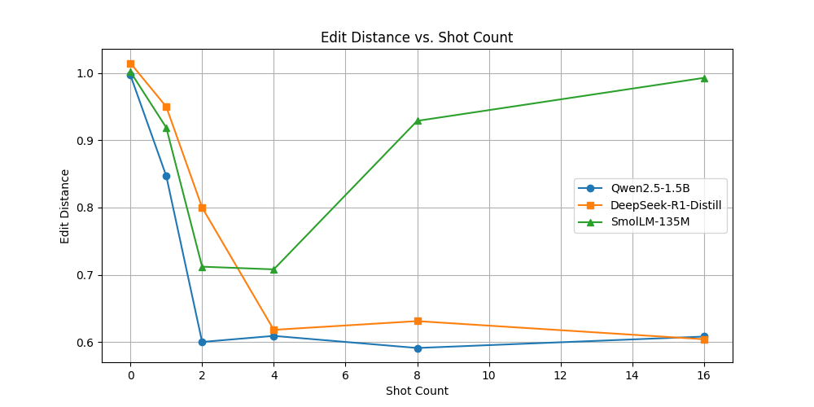

# TP3- Parsing - Author: Gabriele LORENZO

## Answers:

**Cell E Q1: What do the "dependency" metrics measure? You do not need to explain what precision, recall and F1 are, but you do need to explain what sets they are computed against.**

The dependency metrics evaluate how closely the predicted tree’s dependency links align with those in the gold (reference) tree.

Dependency precision measures the proportion of links in the predicted set that also exist in the gold set, while dependency recall quantifies the proportion of gold set links that are correctly identified in the predicted set. The F1 score is calculated as the harmonic mean of precision and recall.

**Cell F Q2: What is BM25? How does this retriever work?**

BM25 (Best Matching 25) is a ranking function used in information retrieval to score documents based on their relevance to a given query.
The BM25 algorithm is an improved version of the TF-IDF algorithm. It uses TF (Term Frequency), IDF (Inverse Document Frequency) and Document Length Normalization to calculate the relevance of a document to a query.

The FewShotRetriever class is designed to find the most relevant examples from a dataset using BM25.

With the `build_index` method, the retriever creates the corpus: a collection of all the inputs of the dataset. This corpus will be then given to the BM25 algorithm to build the index.

The `get_samples` method is used to find the most relevant examples from the dataset given a query. It returns the top_n examples with the highest BM25 scores.

## Results:

In this graph we can see a comprehensive comparison of the edit distance for the different models across different few-shot settings.

Here instead we have the tables with the results for the different models and few-shot settings:

### Model: `Qwen/Qwen2.5-1.5B`

| Shot | Mean  | Interval       | Edit Distance | Dependency F1 | Subtree F1 | Prompt Length (Tokens) | FLOPS (GFLOPs) |
| ---- | ----- | -------------- | ------------- | ------------- | ---------- | ---------------------- | -------------- |
| 0    | 0.997 | [0.995, 0.999] | 0.997         | 0.000         | 0.000      | 30.75                  | 94.95          |
| 1    | 0.847 | [0.801, 0.893] | 0.847         | 0.071         | 0.013      | 277.48                 | 856.78         |
| 2    | 0.600 | [0.559, 0.641] | 0.600         | 0.154         | 0.039      | 538.31                 | 1662.16        |
| 4    | 0.609 | [0.563, 0.655] | 0.609         | 0.134         | 0.029      | 984.63                 | 3040.24        |
| 8    | 0.591 | [0.553, 0.629] | **0.591**     | 0.132         | 0.007      | 1952.19                | 6027.80        |
| 16   | 0.608 | [0.571, 0.644] | 0.608         | 0.143         | 0.016      | 4034.44                | 12457.19       |

### Model: `deepseek-ai/DeepSeek-R1-Distill-Qwen-1.5B`

| Shot | Mean  | Interval       | Edit Distance | Dependency F1 | Subtree F1 | Prompt Length (Tokens) | FLOPS (GFLOPs) |
| ---- | ----- | -------------- | ------------- | ------------- | ---------- | ---------------------- | -------------- |
| 0    | 1.015 | [0.986, 1.043] | 1.015         | 0.000         | 0.000      | 31.75                  | 98.04          |
| 1    | 0.950 | [0.901, 0.998] | 0.950         | 0.032         | 0.005      | 271.13                 | 837.16         |
| 2    | 0.800 | [0.752, 0.848] | 0.800         | 0.051         | 0.005      | 524.00                 | 1617.96        |
| 4    | 0.618 | [0.581, 0.655] | 0.618         | 0.116         | 0.022      | 985.63                 | 3043.33        |
| 8    | 0.631 | [0.587, 0.674] | 0.631         | 0.136         | 0.024      | 1974.48                | 6096.63        |
| 16   | 0.604 | [0.565, 0.643] | **0.604**     | 0.132         | 0.026      | 4035.44                | 12460.28       |

### Model: `HuggingFaceTB/SmolLM-135M`

| Shot | Mean  | Interval       | Edit Distance | Dependency F1 | Subtree F1 | Prompt Length (Tokens) | FLOPS (GFLOPs) |
| ---- | ----- | -------------- | ------------- | ------------- | ---------- | ---------------------- | -------------- |
| 0    | 1.002 | [0.999, 1.005] | 1.002         | 0.000         | 0.000      | 32.25                  | 8.68           |
| 1    | 0.919 | [0.875, 0.964] | 0.919         | 0.021         | 0.001      | 360.19                 | 96.94          |
| 2    | 0.712 | [0.675, 0.750] | 0.712         | 0.098         | 0.015      | 714.59                 | 192.33         |
| 4    | 0.708 | [0.670, 0.747] | **0.708**     | 0.123         | 0.025      | 1385.72                | 372.96         |
| 8    | 0.929 | [0.883, 0.975] | 0.929         | 0.038         | 0.005      | 2747.06                | 739.36         |
| 16   | 0.993 | [0.988, 0.998] | 0.993         | 0.000         | 0.000      | 5385.25                | 1449.41        |

## Analysis:

The results highlight a clear trade-off between performance and computational cost across different few-shot settings for the evaluated models.

For Qwen/Qwen2.5-1.5B, the 0-shot setting exhibits an edit distance of 0.997. Introducing few-shot examples improves performance: the 1-shot setting reduces the edit distance to 0.847, and the 2-shot setting further drops it to 0.600, meaning substantially fewer modifications are needed. However, beyond 2-shot, the improvements in edit distance (with values around 0.609, 0.591, and 0.608 for 4-, 8-, and 16-shot respectively) plateau, even as computational demands (GFLOPs) and average prompt lengths increase dramatically.

A similar pattern emerges for DeepSeek-R1-Distill-Qwen-1.5B, where the 0-shot edit distance is very poor (1.0146), but few-shot prompting progressively improves performance, reaching an edit distance of 0.6043 at 16-shot.

In contrast SmolLM-135M, a considerably smaller model, starts with a 0-shot edit distance of 1.0017, improves to 0.7125 at 2-shot, and achieves the best performance at 4-shot with an edit distance of 0.7081.
As we can see, the results sharply decline for 8 and 16 few-shot settings, with edit distances of 0.9291 and 0.9930 respectively. This is due to the limited context window of the model (only 2048 tokens), and as we can see the prompt length for 8 and 16 shots is respectively 2747.06 and 5385.25 tokens.

The overall best performance (in terms of lower edit distance) is achieved by Qwen2.5-1.5B at 8-shot, with an edit distance of 0.591 and a dependency F1 of 0.1536. However, this comes at a high computational cost of 6027.80 GFLOPs and a prompt length of 1952.19 tokens.
